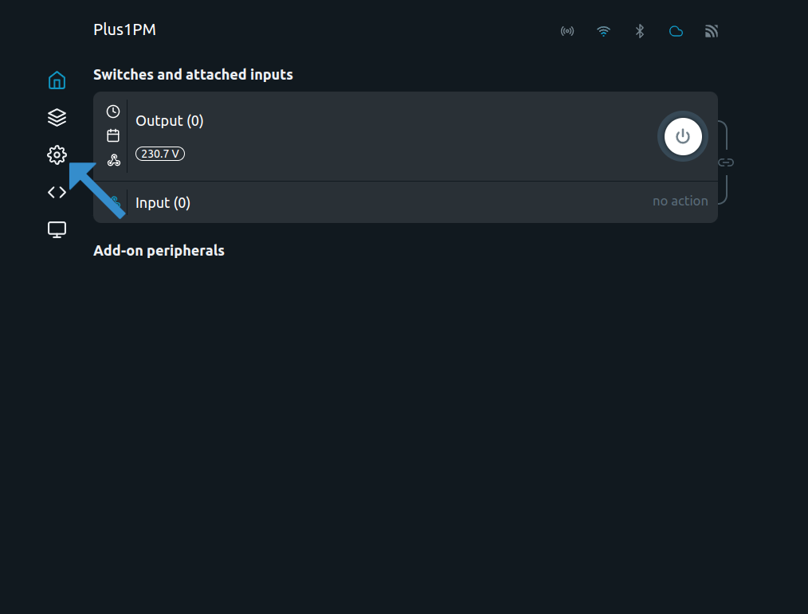
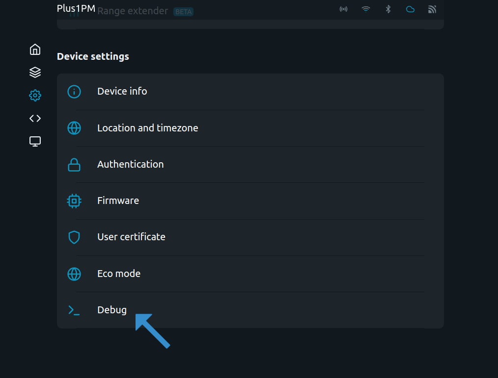
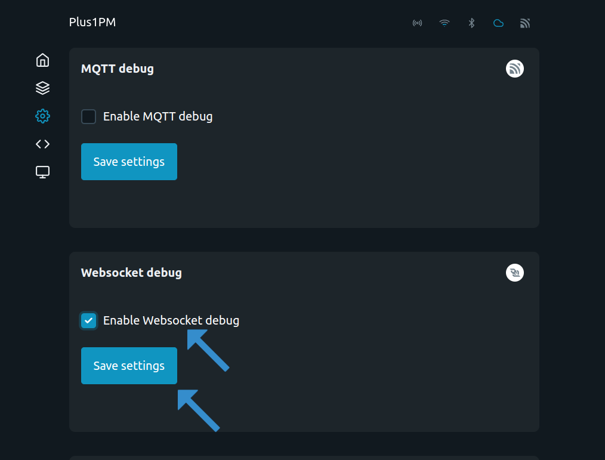

 
# Turn Shelly On/Off Based on Energi Data Service Danish current Spotprice
 
This code pulls the current price from energidataservice API

# Script setup
You only have to 
First enter The Shelly's Web UI By entering it's ip-adress in a browser.
 

### Go to Setting



Go to Debug


Enable Websocket debug and Save Settings




## Configure API endpoint
Find `api_endpoint` and change `#COUNTRY_CODE#` 🌍 to ee, lv, lt or fi
```
api_endpoint: "https://dashboard.elering.ee/api/nps/price/#COUNTRY_CODE#/current"
```
 
## Set your price point  👈
Find configuration value `price_limit` will be set when your device turns on or off. Prices don’t include VAT and are measured in DKK/MWh
### Example
```  price_limit: 200 ```
Will set toggling threshold for the device to 200 DKK/MWh
 
## Setting relay to switch.
Most shelly devices have only one output(relay). If you want to change the output channel find `switchId` and set it to the desired output.
 


