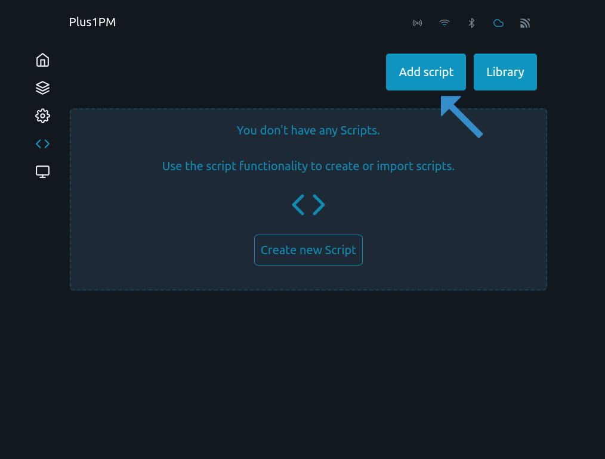
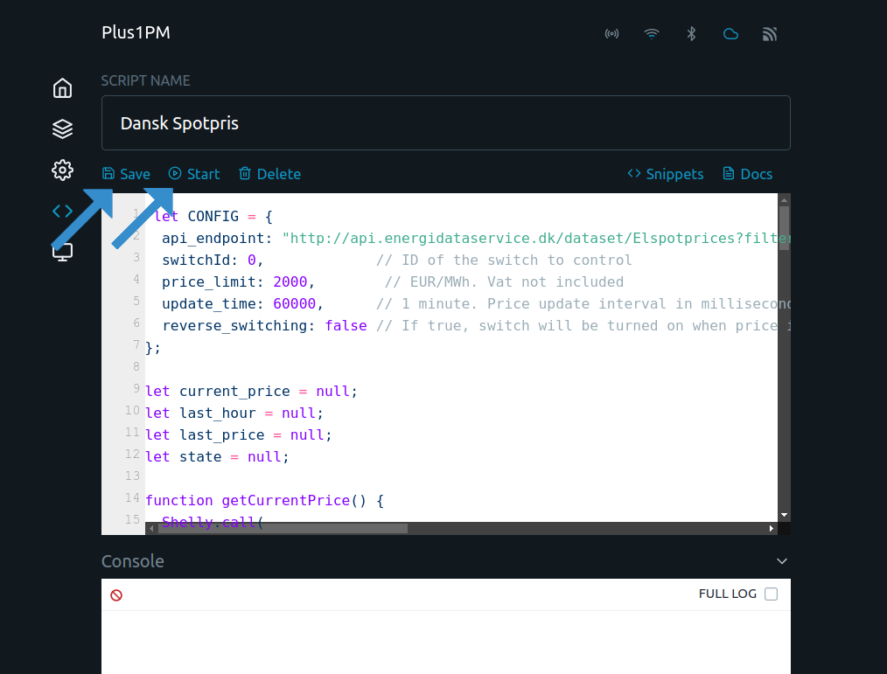

 
# Turn Shelly On/Off Based on Energi Data Service Danish current Spotprice
 
This code pulls the current price from energidataservice API

# Setup

- ### First enter The Shelly's Web UI By entering it's ip-adress in a browser.


 

- ### Go to Setting


- ### Go to Debug


- ### Enable Websocket debug and Save Settings


- ### Add Script




- ### Paste in the Code




```
let CONFIG = {
  api_endpoint: "http://api.energidataservice.dk/dataset/Elspotprices?filter={%22PriceArea%22:[%22DK2%22]}&columns=SpotPriceDKK,HourDK&sort=HourDK&start=now-P1D&limit=2&offset=23",
  switchId: 0,             // ID of the switch to control
  price_limit: 500,        // EUR/MWh. Vat not included
  update_time: 5000,      // 1 minute. Price update interval in milliseconds
  reverse_switching: false // If true, switch will be turned on when price is over the limit
};

let current_price = null;
let last_hour = null;
let last_price = null;
let state = null;
```
## Configure API endpoint
Find `api_endpoint` and change `#COUNTRY_CODE#` 🌍 to ee, lv, lt or fi
```
api_endpoint: "https://dashboard.elering.ee/api/nps/price/#COUNTRY_CODE#/current"
```
 
## Set your price point  👈
Find configuration value `price_limit` will be set when your device turns on or off. Prices don’t include VAT and are measured in DKK/MWh
### Example
```  price_limit: 200 ```
Will set toggling threshold for the device to 200 DKK/MWh
 
## Setting relay to switch.
Most shelly devices have only one output(relay). If you want to change the output channel find `switchId` and set it to the desired output.
 


